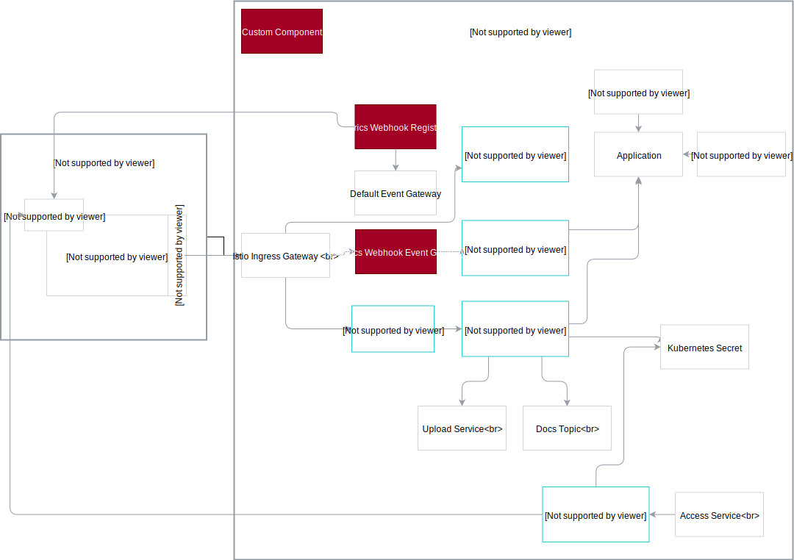

## :warning: **Archived**

This repository has been deprecated and archived on Oct 26th, 2022.

#  Connector Tools

`Connector-tools` contain projects required to build a `Kyma`connector bundle. It is meant to be used for connecting an application to kyma having no built-in Kyma pairing logic provided.

The repository does not contain the actual bundle definition, it is providing the source code for the different tools only.
Samples for actual bundles will be provided soon.

## Components of the Bundle (MQTT Event Bridge, OAuth2 Server & API Registration Job)

|Component|Description|
|---|---|
|MQTT Event Bridge|NodeJS application which consumes MQTT messages, transforms them into a JSON payload and forwards them to the Kyma event bus|
|OAuth2 Server|NodeJS based OAuth2 server with configurable client secrets for the client_credentials grant used for MQTT message authentication|
|API Registration Job|Golang application to register configured ODATA services and events types to a configured Kyma Application. It will check if the API will respond before it gets registered.|

## Components of the Bundle (Qualtrics specific)

|Component|Description|
|---|---|
|Qualtrics Webhook Event Gateway|Golang application that implements an endpoint to ingest Qualtrics webhook calls as events into Kyma.|
|Qualtrics Webhook Registration|Golang application to register subscribed Qualtrics events from Kyma as Qualtrics subscriptions.|

## Components of the Bundle (Open Connectors specific)

|Component|Description|
|---|---|
|Open Connectors Job|Golang application that synchronizes the state between Compass and SAP Cloud Platform Open Connectors.|

